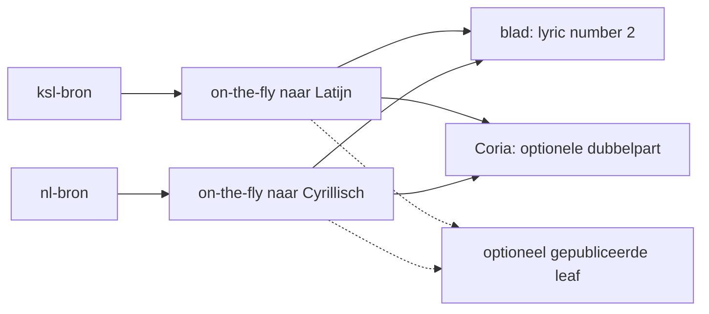
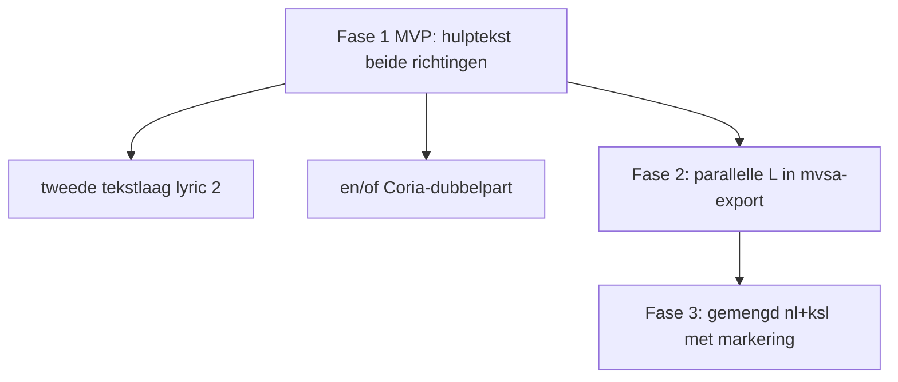

# Kerkslavische hulptekst (transliteratie) — werkplan

| Veld            | Waarde                                                                                                                                                                                                                                       |
| --------------- | -------------------------------------------------------------------------------------------------------------------------------------------------------------------------------------------------------------------------------------------- |
| **Status**      | werkplan; **fase 1–3 gedaan**; expert-review: [hulptekst-reviewcorpus](hulptekst-reviewcorpus.md)                                                                                                                                            |
| **Doel**        | Bidirectionele hulptekst (ksl → Latijn én nl → Cyrillisch) in blad- en Coria-export, zonder echte tweede melodiestem                                                                                                                         |
| **Eigenaar**    | Transliterator + export: [VSA-tooling](@bron); catalogus-id/map: bibliotheek (handover 1); org-termen: [bron glossary](https://github.com/orthodox-ronl/bron/blob/main/docs/specs/terminologie.md)                                           |
| **Gerelateerd** | [mvsa-conversions](mvsa-conversions.md), [mvsa-v0-syntax §11](mvsa-v0-syntax.md#11-blokhergebruik-en-parallelle-l-schets), [specification-mvsa](../specification-mvsa/README.md), [canonieke checklists](../formats/canonical-checklists.md) |

Dit document is een **bouwplan** voor een volgende Agent-fase. Het is geen
productspecificatie: bij tegenstrijdigheid gelden de draft-specs onder
`docs/specification-mvsa/` en de [canonieke checklists](../formats/canonical-checklists.md).

**Korte terugverwijzing** vanuit de bibliotheek-handleiding (na handover 1)
hoort als aparte kleine follow-up; die staat niet in deze taak.

---

## 1. Doelen en non-goals

### Doelen

Koorleden lezen niet allemaal hetzelfde schrift. De toolchain moet daarom
**hulptekst** kunnen tonen naast de brontekst: dezelfde noten, andere
lettertekens, dezelfde lettergreepdeling (zelfde event-telling).

Twee richtingen zijn kernvereiste:

| Richting             | Bronschrift                         | Hulptekst                         | Voor wie                                                          |
| -------------------- | ----------------------------------- | --------------------------------- | ----------------------------------------------------------------- |
| **ksl → Latijn**     | Kerkslavisch (Cyrillisch)           | Latijnse weergave                 | Nederlandstalige zangers; herkenbaar voor Russischtalige lezers   |
| **nl → Cyrillisch**  | Nederlands (Latijn)                 | Cyrillische weergave              | Koorleden uit het (voormalig) oostblok op een Nederlands blad     |

Die hulptekst komt in de exportketens **zonder** een tweede echte melodiestem:

- **Blad / print** (`.mscz`, via MusicXML): tweede tekstlaag onder dezelfde
  noten — MusicXML `<lyric number="1">` = brontekst, `number="2"` = hulptekst
  («tweede couplet»).
- **Coria / oefenen** (`.mxl`): optioneel extra MusicXML-**parts** — één per
  stem × lyrics-laag, met part-namen `{stem} ({@taal-label})` (bv.
  `Sop (aap)` / `Zeep (noot)`). De speler kiest; beide hard tegelijk (dubbel
  geluid) is niet de bedoeling. Dit zijn geen echte stemmen.

In de **catalogus** (bibliotheek) blijven taalvarianten via suffix op
[uitvoeringsvorm-id](@bron) (`-nl` / `-ksl`) plus leaf-map — vastgelegd of
parallel gedocumenteerd in handover 1. Hulptekst is **geen** standaard derde
handmatige notatiebron.

### Non-goals

- Geen los MIDI-product (preview blijft audio; zie
  [formats/midi.md](../formats/midi.md)).
- Geen echte tweede stem of SATB-partij voor de hulptekst.
- Geen verplichte handmatige bronbestanden zoals `…-ksl-trlat` of `…-nl-cyr`
  voor elk stuk.
- Geen volledige herstructurering van de catalogus vanuit VSA-tooling.
- Geen automatische **vertaling** van betekenis (NL ↔ kerkslavisch); alleen
  schrift- en uitspraakweergave.

---

## 2. Ownership

| Onderdeel                                                                                                                       | Eigenaar                                                          |
| ------------------------------------------------------------------------------------------------------------------------------- | ----------------------------------------------------------------- |
| Transliterator (beide richtingen), CLI/API, exportgedrag (blad lyric 2 / Coria-dubbelpart)                                      | **VSA-tooling**                                                   |
| Catalogus-id- en map-conventie (`-nl` / `-ksl`, leaf-mappen, optionele gepubliceerde afgeleide)                                 | **bibliotheek** (verwijzing; details in handover 1)               |
| Org-termen ([zangstuk](@bron) → [variant](@bron) → [uitvoeringsvorm](@bron) → [representatie](@bron); bronbestand vs afgeleide) | **bron** glossary                                                 |

---

## 3. Bronbestand versus afgeleide



**Default:** bij export alleen een **on-the-fly** product. Er is geen extra
bronbestand verplicht. De richting volgt de brontaal van de passage.

**Optioneel:** een gepubliceerde leaf (legacy-achtig `…-ksl-trlat`, of later
`…-nl-cyr`) als expliciete **afgeleide** [representatie](@bron) wanneer
reviewers een vastgelegde spelling willen vastzetten. Die leaf vervangt nooit
het bronbestand.

**NL versus kerkslavisch** met andere lettergreepdeling = **aparte**
[uitvoeringsvormen](@bron) (`-nl` / `-ksl`). Die zijn **geen** tweede lyric-laag
van elkaar. Parallelle hulptekst (L2 / lyric number 2) hoort bij de **actieve
bronpassage**: Latijn bij kerkslavische passages, Cyrillisch bij Nederlandse
passages.

---

## 4. Transliterator-contract

Eén module, twee richtingen. Geen productiecode in dit document — alleen het
contract zodat een volgende fase kan bouwen zonder de architectuur opnieuw uit
te vinden.

### Input en output

|                | Afspraak                                                                                                                            |
| -------------- | ----------------------------------------------------------------------------------------------------------------------------------- |
| **Input**      | Lettergreep-/token-reeks uit de lyrics-laag (hyphenatie behouden) plus richting of brontaal. Geen vrije proza-zin als primaire API. |
| **Output**     | Even lange tokenreeks. Streven naar 1:1 lettergreep-mapping. Bij split-mismatch: expliciete fout of warning.                        |
| **Richtingen** | `ksl_to_latin` (Cyrillisch → Latijn) en `nl_to_cyrillic` (Latijn NL → Cyrillisch).                                                  |
| **Schema**     | Standaard `parochie` (parochiepraktijk). Wetenschappelijke ISO-schema’s zijn bewust later.                                          |

### Kwaliteitsdoel

Wederzijds acceptabele **uitspraakweergave** voor parochiegebruik: een
Nederlandstalige zanger moet kerkslavisch kunnen meelezen in Latijnse letters;
een Cyrillisch-geletterde zanger moet Nederlandse tekst kunnen meelezen in
Cyrillisch. Roundtrip letter-voor-letter is **niet** het doel. Leesbaarheid en
meezingen wel.

### Testcorpus (idee)

Twee kleine fixture-sets:

1. Kerkslavisch → Latijn: woorden plus korte litanie- of hymnepassages met
   expected Latin.
2. Nederlands → Cyrillisch: woorden plus korte passage met expected Cyrillisch.

Spot-check door een Nederlandstalige lezer én een Cyrillisch-geletterde lezer
vóórdat het schema «vast» heet voor MVP.

### Wat handmatig mag blijven

- Eigennamen en bekende uitzonderingen (override-lijst).
- Passages waar de lettergreepdeling van het bronbestand afwijkt van wat de
  tabel zou voorspellen.
- Optioneel: gepubliceerde leaf wanneer reviewers een spelling willen
  bevriezen.

### Pseudo-API (schets)

```text
render_syllables(
    syllables: list[str],
    *,
    direction: "ksl_to_latin" | "nl_to_cyrillic",
    scheme: str = "parochie",
) -> list[str]
```

CLI-vorm (later, niet in deze taak): bijvoorbeeld een vlag op bestaande
exportcommando’s, of een apart hulpmiddel dat alleen tokens omzet voor
inspectie.

---

## 5. Blad-pad versus Coria-pad

| Pad             | Formaat                | Mechanisme                                                                                                                                   | Gebruik                                          |
| --------------- | ---------------------- | -------------------------------------------------------------------------------------------------------------------------------------------- | ------------------------------------------------ |
| Blad / print    | `.mscz` (via MusicXML) | Zelfde noten; lyric number 1 = brontekst, number 2 = hulptekst (Latijn bij ksl-bron, Cyrillisch bij nl-bron)                                 | Zingen van papier / partituur in MuseScore       |
| Coria / oefenen | `.mxl`                 | Extra part(s) per stem × lyrics-laag; namen `{stemidentifier} ({@taal-label})`, bv. `Soprano (ksl)` of `Sop (aap)`; geen echte stemmen       | Solo/mute in de speler; niet beide hard tegelijk |

**Samenvatting voor niet-programmeurs:** op het **blad** staan twee tekstregels
onder dezelfde noten (bron + hulp). In **Coria** mag de oefenaar kiezen welke
tekstlaag te zien is via een aparte «part» die muzikaal hetzelfde klinkt — het
zijn geen twee koorstemmen.

Raakvlak met de checklists: vandaag eist
[canonical-checklists](../formats/canonical-checklists.md) bij Coria vooral
lyric number 1 per part (M3). Lyric number 2 op het blad en optionele
Coria-extra-parts voor hulptekst horen als **latere checklist-items** bij de
implementatiefase; dit plan herschrijft die checklists nog niet.

---

## 6. Converter-ketens en MVP-prioriteit



| Fase        | Wat bouwen                                                                                                                                                                                                                                     | Wat niet verplicht is                                                   |
| ----------- | ---------------------------------------------------------------------------------------------------------------------------------------------------------------------------------------------------------------------------------------------- | ----------------------------------------------------------------------- |
| **1 — MVP** | Transliterator-module (beide richtingen) + export `.vsa` / `.mvsa` → mxl/mscz met lyric number 2; optioneel Coria-dubbelpart (vlag zoals `--hulptekst-as-parts`). Minstens één geïntegreerd voorbeeld **ksl→Latijn** én één **nl→Cyrillisch**. | `vsa→mvsa` als tussenstap alleen als die nuttig is — niet voor elk pad. |
| **2**       | Parallelle L in mvsa (`L:` / `L1:` of schets `L'`) exporteren naar lyric numbers. Nu nog «buiten v0» in [validation](../specification-mvsa/validation.md) en [mvsa-conversions §6](mvsa-conversions.md#6-bewust-later--buiten-slice).          | Volledige blokhergebruik-semantiek (`@voices`, deelbereiken).           |
| **3**       | Gemengd nl+ksl in één [uitvoeringsvorm](@bron) (bijv. cherubijnenhymne): per gemarkeerde passage de juiste richting.                                                                                                                           | Automatische taaldetectie zonder markering.                             |

---

## 7. Markering voor gemengde stukken (nl + ksl)

Sommige stukken mengen Nederlands en kerkslavisch in **één**
[uitvoeringsvorm](@bron) (klassiek voorbeeld: cherubijnenhymne). De converter
mag dan niet blind alles omzetten: Nederlandse passages krijgen Cyrillische
hulptekst; kerkslavische passages krijgen Latijnse hulptekst. Daarvoor is
**markering per passage of segment** nodig.

### Opties

| Optie              | Idee                                            | Voordeel                                                             | Nadeel                             |
| ------------------ | ----------------------------------------------- | -------------------------------------------------------------------- | ---------------------------------- |
| **A (aanbevolen)** | Sticky `@taal nl` / `@taal ksl` tussen passages | Past bij gereserveerde `@taal` in mvsa-keywords; leesbaar in de bron | Vereist discipline bij redacteuren |
| **B**              | Inline span-tags in de L-regel                  | Fijnmazig binnen één regel                                           | Zwaarder voor lezers en parser     |
| **C**              | Prefix per lettergreep                          | Technisch eenduidig                                                  | Te luidruchtig; afwijzen voor v0   |

### Aanbevolen richting

**Optie A.** De converter past **per actieve taal** de richting toe:

- actief `ksl` → hulptekst Latijn (`ksl_to_latin`);
- actief `nl` → hulptekst Cyrillisch (`nl_to_cyrillic`).

Lyric number 1 blijft de originele brontekst van die passage.

Wanneer de **melodie of lettergreepdeling** tussen Nederlands en kerkslavisch
verschilt, blijven dat aparte [uitvoeringsvormen](@bron) (`-nl` / `-ksl`).
Markering lost dat verschil niet op.

---

## 8. Raakvlakken met bestaande specs

| Document                                                                         | Wat relevant is                                                                               |
| -------------------------------------------------------------------------------- | --------------------------------------------------------------------------------------------- |
| [mvsa-v0-syntax §11](mvsa-v0-syntax.md#11-blokhergebruik-en-parallelle-l-schets) | Schets parallelle tekstlagen `L:` + `L':` (zelfde events; bv. kerkslavisch + transliteratie). |
| [specification-mvsa/overview](../specification-mvsa/overview.md)                 | Meerdere talen of transliteraties tegelijk genoemd.                                           |
| [specification-mvsa/validation](../specification-mvsa/validation.md)             | Sync van parallelle lyrics (`L` en `L1`); export van lyric numbers nog buiten v0.             |
| [mvsa-conversions](mvsa-conversions.md)                                          | Conversiematrix; parallelle lyrics staan onder «bewust later».                                |
| [canonical-checklists](../formats/canonical-checklists.md)                       | M-reeks Coria / S-reeks partituur; lyric number 1 vandaag; uitbreiding later.                 |
| [open-points](../specification-mvsa/open-points.md)                              | Centrale backlog; punt «Hulptekst / parallelle lyrics» verwijst hierheen.                     |

---

## 9. Testraamwerk en succescriteria per fase

### Fase 1 (MVP)

- Unit-tests op **beide** corpusrichtingen (ksl→Latijn en nl→Cyrillisch).
- Eén kerkslavisch voorbeeld → MusicXML/MSCZ met lyric 1 = ksl, lyric 2 =
  Latijn; opent bruikbaar in MuseScore 4.
- Eén Nederlands voorbeeld → lyric 1 = nl, lyric 2 = Cyrillisch.
- Coria-bestand(en) met keuze-parts; default geen dubbel geluid.

### Fase 2

- mvsa met `L` + `L1` exporteert naar MusicXML lyric numbers.
- `mvsa validate` blijft groen op sync van parallelle lyrics.

### Fase 3

- Gemengde fixture (cherubijnen-achtig): per `@taal`-passage de juiste
  hulptekst-richting.
- Validate en export groen met markering.

---

## 10. Gebruik in bibliotheek (consumer)

**Doelgroep:** redacteur of build-beheerder die `.mvsa` uit de bibliotheek naar
Coria-MXL of print-MSCZ genereert.

1. **Tooling-versie.** Hulptekst zit op `main` (na merge uit `development`).
   Pin in bibliotheek-CI of lokaal minstens op die commit, of op een release-tag
   zodra die staat — zie
   [Releases: taggen en pinnen](../manuals/releases.md).

2. **Coria-publicatie** (playback-MXL in `static/` of catalogus-leaf):

```cmd
cd /d C:\Git\orthodox-ronl\bibliotheek
python -m pip install "vsa-tool[rendering] @ git+https://github.com/orthodox-ronl/VSA-tooling.git@main"
vsa mvsa validate content-source\bibliotheek\<zangstuk>\<variant>\<uitvoeringsvorm>\bron.mvsa
vsa mvsa musicxml content-source\bibliotheek\<zangstuk>\<variant>\<uitvoeringsvorm>\bron.mvsa --hulptekst-as-parts -o generated\coria\<representatie-id>.mxl --bibliotheek-id <zangstuk>/<variant>/<uitvoeringsvorm>
```

   Vervang paden door jullie echte mapconventie. In het `.mvsa`: `@taal` zetten
   waar nl en ksl door elkaar lopen; optioneel `@taal Lap=aap Lus=noot` voor
   vrije Coria-labels.

3. **Print voor zangers** (tweede tekstregel op het blad):

```cmd
vsa mvsa mscz …\bron.mvsa --hulptekst -o generated\print\….mscz --bibliotheek-id …
```

4. **Wat de bibliotheek zelf beslist:** welke representatie een Coria-MXL krijgt,
   of hulptekst verplicht is, en freshness/sync — dat blijft consumer-beleid
   ([reuse-vsa-tooling](../guides/reuse-vsa-tooling.md#ownership-tooling-vs-consumer)).

Transliterator-kwaliteit (parochieschema) is een **apart** traject via
[hulptekst-reviewcorpus](hulptekst-reviewcorpus.md); export werkt al met het
huidige schema.

---

## 11. Bewust later / buiten scope

- Wetenschappelijke transcriptieschema’s als productoptie naast `parochie`.
- Automatische detectie van taal zonder markering.
- Verplichte publicatie van elke hulptekst als catalogus-leaf.
- Betekenisvertaling NL ↔ kerkslavisch.
- Los MIDI; echte tweede melodiestem; catalogusherstructurering vanuit deze
  repo.

---

## Leesvolgorde voor de volgende bouwfase

1. Dit document §1–5 (beleid blad/Coria + contract).
2. [mvsa-conversions](mvsa-conversions.md) (bestaande exportketen).
3. [canonical-checklists](../formats/canonical-checklists.md) (wat MXL/MSCZ nu
   al eisen).
4. [mvsa-v0-syntax §11](mvsa-v0-syntax.md#11-blokhergebruik-en-parallelle-l-schets)
   en validation «buiten v0» voor parallelle lyric-nummers.
5. Bouwen volgens §6 fase 1; markering §7 pas in fase 3 hard nodig.
